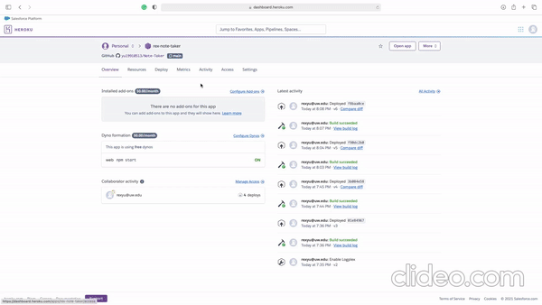

# Note Taker (Back-end Project)

## Description
This project allows student developers to practice building a server for the website. The front end has been created. Student developers only need to focus on back end to ensure the functionality of the website. Note Taker website is created to help busy professional to list to-do items and remove them as the items has been done.

## Table of Contents
- [Installation](#installation)
- [Usage](#usage)
- [Credits](#credits)
- [License](#license)

## Installation
Installation is not needed for this deployed app. Just need to simply click the following url.

## Usage

### click her to deployed app (https://rex-note-taker.herokuapp.com)

## Contributing
you may fork this application by the following steps
 1. **Fork** the repo on GitHub
 2. **Clone** the project to your own machine
 3. **Commit** changes to your own branch
 4. **Push** your work back up to your fork
 5. **Other Notes**

## Credits
* Rex
* Google

## License
* Licensed under the GNU General Public License (GPL) License. Copyright © 2021
---
## Contacts
GitHub: [yu19910513](https://github.com/yu19910513/)

Email: [yu19910513@gmail.com](mailto:yu19910513@gmail.com)

## MIT License

Permission is hereby granted, free of charge, to any person obtaining a copy of this software and associated documentation files (the "Software"), to deal in the Software without restriction, including without limitation the rights to use, copy, modify, merge, publish, distribute, sublicense, and/or sell copies of the Software, and to permit persons to whom the Software is furnished to do so, subject to the following conditions:

The above copyright notice and this permission notice shall be included in all copies or substantial portions of the Software.

THE SOFTWARE IS PROVIDED "AS IS", WITHOUT WARRANTY OF ANY KIND, EXPRESS OR IMPLIED, INCLUDING BUT NOT LIMITED TO THE WARRANTIES OF MERCHANTABILITY, FITNESS FOR A PARTICULAR PURPOSE AND NONINFRINGEMENT. IN NO EVENT SHALL THE AUTHORS OR COPYRIGHT HOLDERS BE LIABLE FOR ANY CLAIM, DAMAGES OR OTHER LIABILITY, WHETHER IN AN ACTION OF CONTRACT, TORT OR OTHERWISE, ARISING FROM, OUT OF OR IN CONNECTION WITH THE SOFTWARE OR THE USE OR OTHER DEALINGS IN THE SOFTWARE.

